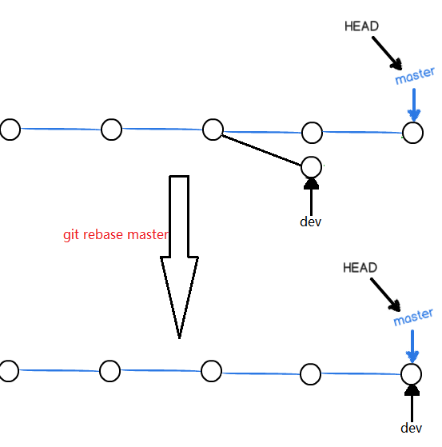
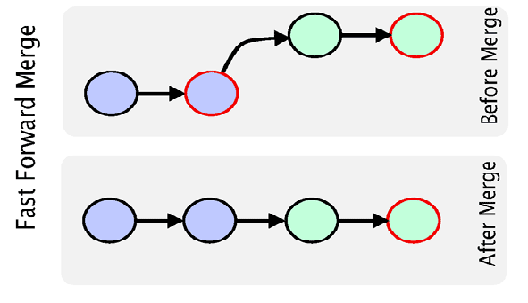

git总结
===============
今天无意中看到据说是[史上最简单的Git教程](http://www.liaoxuefeng.com/wiki/0013739516305929606dd18361248578c67b8067c8c017b000),看完后又学到了不少新东西，把自己学到东西总结并记录下，否则总觉得少了些什么东西。  

###基本概念

* 工作区（working dicrectory）：包含.git目录的父目录一般就是工作区，就是我们的工程目录。新创建的文件都处于工作区，此时文件还没有加入到后面要解释的的暂缓区。 
* 版本库（Repository）：.git目录就是版本库，版本管理的相关文件都在此目录下。  
* 暂缓区（stage）：对于曾经加入了版本控制的文件作了修改后，执行`git add `后的文件就进入暂缓区。

如下有一个readme.rst文件是已经加入了版本库的，现在对内容进行修改后，查看下状态  

    E:\Users\liuzhijun\workspace\blog>git status

    # On branch master
    # Your branch is ahead of 'origin/master' by 4 commits.
    #   (use "git push" to publish your local commits)
    #
    # Changes not staged for commit:
    #   (use "git add <file>..." to update what will be committed)
    #   (use "git checkout -- <file>..." to discard changes in working d
    #
    #       modified:   README.rst
    #
    no changes added to commit (use "git add" and/or "git commit -a")

git提示README.rst已经修改了，但还不是暂缓区的文件（not staged），待commit。接着还告诉你可以进行怎么的操作，`checkout`指撤销本次修改，注意后面有`--`，如果不带这个字符，checkout又是另外一层意思了。  

####退回到指定版本
退回到指定版本使用命令`git reset --hard <version>`， HEAD始终指向当前版本，HEAD^^表示上一个版本。如果想退回到上一个版本就可以使用：

    git reset --hard HEAD^^  
如果想退回到指定的某个版本呢？可以使用`git log`查看获取commit 版本号：  

    commit 33b351ae746edaf3fd5a56a0318235096b6ed1ce
    Author: liuzhijun <lzjun567@gmail.com>
    Date:   Sat Mar 15 11:43:56 2014 +0800
        commit many files

    commit 86eefaaea5251fa5707ecd02009c893c098ab6cd
    Author: liuzhijun <lzjun567@gmai..com>
    Date:   Thu Mar 14 03:20:27 2013 +0800
    
        add author myself

commit 后面的那串就是版本号， 一般只要选择前面几位就可以了。git会自动去查找。  
    
    git reset --hard 86eefa
执行上面的命令就是退回到指定的版本，如果现在我又反悔了，想恢复到最近的那个版本怎么办？只要你还记得这个最近的版本号的话直接执行如上的命令就好了，但是谁会去记这个号啊？那么还有一个办法是使用`git reflog`查看，这个指令记录了每次的操作。  

    E:\Users\liuzhijun\workspace\blog>git reflog
    a11c917 HEAD@{0}: reset: moving to a11c
            HEAD@{1}: reset: moving to HEAD^
            HEAD@{2}: reset: moving to a11c917430050a94549e48d205ef01cacc82c1cf
            HEAD@{3}: reset: moving to HEAD^

上面的allc...就是我最近的一次修改。

####修改（change）
这里的**修改**不是动词，而是名词，只要文件发生了变化就表示修改，包括对文件内容的更改或者新创建的一个文件或者删除一个文件都叫一个修改。 git跟踪（track）的就是修改，而不是文件本身。   

####撤销（checkout）
撤销是指文件修改后，还没有添加到暂缓区（还没有执行git add）过程中的修改撤销掉，如果已经添加到了暂缓区，但是还没有commit到分支中去，又做了修改后又想撤销，那么这里的撤销就是撤销到暂缓区的状态。比如现在对文件添加内容"add some to file":    

    E:\Users\liuzhijun\workspace\blog>git status
    # On branch master
    # Your branch is ahead of 'origin/master' by 4 commits.
    #   (use "git push" to publish your local commits)
    #
    # Changes not staged for commit:
    #   (use "git add <file>..." to update what will be committed)
    #   (use "git checkout -- <file>..." to discard changes in working directory)
    #
    #       modified:   README.rst

然后把它添加到暂缓区：  
    
    git add README.rst

再添加内容 "add some again to file"，撤销后，你会发现第一次添加的内容保留了，第二次添加的内容撤销了。  

    E:\Users\liuzhijun\workspace\blog>git checkout -- README.rst
        
    E:\Users\liuzhijun\workspace\blog>git status
    # On branch master
    # Your branch is ahead of 'origin/master' by 4 commits.
    #   (use "git push" to publish your local commits)
    #
    # Changes to be committed:
    #   (use "git reset HEAD <file>..." to unstage)
    #
    #       modified:   README.rst
    
###分支管理
开发一个新功能时，可能需要几周的时间才能完成，那么可以创建一个分支，在分支上做开发，而不影响主分支的功能。  
####创建分支：  

    git branch dev
    git checkout dev
或者合并成一条命令：  

    git checkout -b dev
创建dev分支切换后，HEAD指针就从原来的master转移指向dev分支，`git branch`可以查看有哪些分支，并且当前是在哪个分支上。  

    E:\Users\liuzhijun\workspace\blog>git branch
    * dev
      master
星号就代表当前的所在的分支。    

####切换分支：  

    git checkout master

####合并分支：  
切换分支后，dev分支上做的修改在master分支看不到，如果dev分支的功能开发完成后，就可以考虑合并分支了，合并后还可以删除dev分支，因为此时dev分支对于我们来说没有多大意义了。  

    git merge dev
合并分支就是把master执行dev分支，接着还可以删除分支  
    
    git branch -d dev

git鼓励大家使用分支，因此大家记得多用啊，只有多用才是熟练掌握。  

###冲突
如果不同的人对同一个文件的同一个地方做了修改，那么提交后就会遇到冲突，或者在不同的分支上修改了同一个文件的同一个地方也会出现冲突，当出现冲突了，就必须手动把有冲突的地方修改后再提交才能解决冲突。  

创建分支dev，然后添加内容"add new branch dev"，commit后切换到master分支，在同一行添加内容"may be here is conflict"，commit后合并。  

    git checkout -b dev
    git add README.rst
    git commit -m "add new branch"
    git checkout master
    git add README.rst
    git commit -m "add new line"
    git merge dev
    
    #出现错误
    Auto-merging README.rst
    CONFLICT (content): Merge conflict in README.rst
    Automatic merge failed; fix conflicts and then commit the result.

README.rst内容出现了如下情况：  

    <<<<<<< HEAD
    may be here is conflict
    =======
    add new branch dev 
    >>>>>>> dev
   
\<<<<<<< 到=======\表示当前分支的内容， >>>>>表示dev里面的内容。手动修改里面的内容后再提交。那么master就是最新的文件了。当然dev还是停留在上次commit的状态。此时你可能会想，我想在dev分支上与master保持同样的最新状态，那么你可以这样：    

    git checkout dev
    git rebase master

相当于快速的把dev分支指向master。  

####分支策略
开发过程中，都应该按照以下方式来管理分支。  
**主分支**：代码库应该有且只有一个主分支master，master分支的代码是稳定的，仅用于正式版本发布使用。  

**开发分支**：日常开发工作应该在开发分支dev上完成，待某个时间dev分支的功能完善了就可以考虑merge到master分支上去。  

**自己的分支**：每个人在dev分支上建立自己的分支。  
默认情况下，git合并使用"fast forward”模式，相当于直接把master分支指向dev分支。删除分支后，分支信息也随即丢失。  

在合并的时候附上参数 `--no-ff`就可以禁用fast-forward合并模式。这样在master上能生成一个新的节点，意味着master保留的分支信息，而这种合并方式我们希望采用的。  
    
    git merge --no-ff dev

