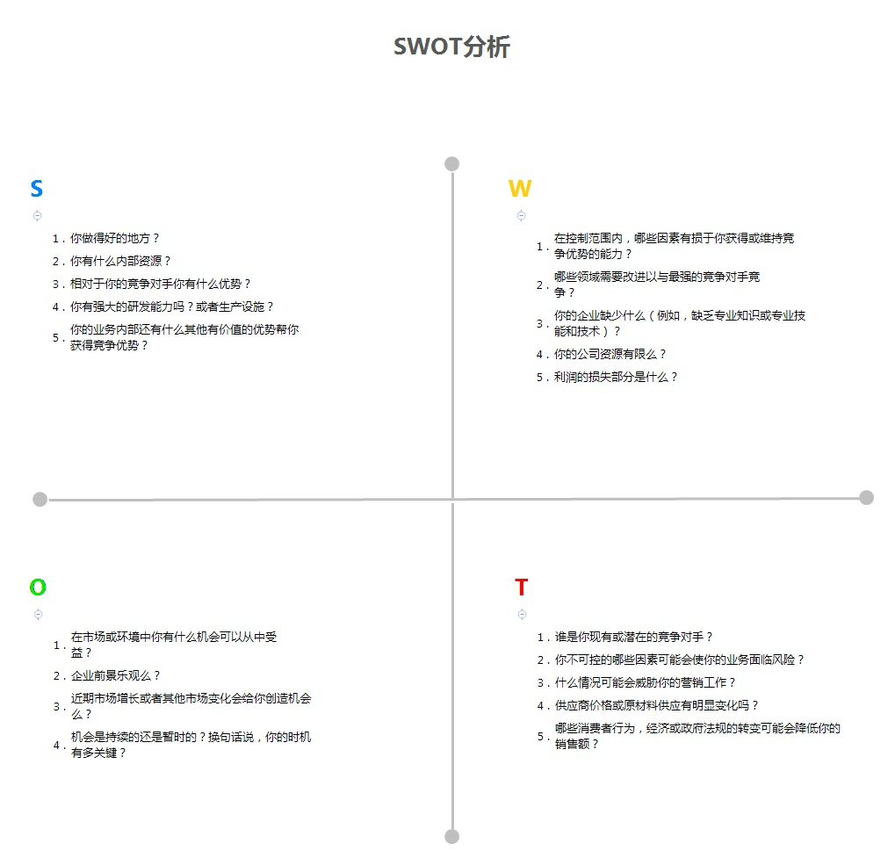

# why

工作要善于总结，也要善于表达，如何在十多分钟内将自己一年辛苦的成绩表达出来，这是体现个人能力的最佳时刻。

# what

## 总结归纳

> （根据个人岗位职责，用数据说话，客观陈述一年实况，再根据今年表现来写明年规划）

1. 何为岗位职责？指一个岗位所要求的需要去完成的工作内容以及应当承担的责任范围。

2. 业绩回顾: 再拉出自己一年的KPI（关键绩效指标），标记哪些项达标了，哪些未达标，（**用具体数据陈述事实**），对最关键的指标，以月为单位，做出折线图或者柱状图来看其整年的变化趋势，然后针对其业绩的趋势进行分析，什么指标做的好，为什么达成？什么指标做的不好，达不成的原因在哪里？（根据一年的趋势图，不同时间点做了那些事情来保证支撑自己KPI，写干货，实际的事情，取得什么效果，**用数据支撑**，不要用一些程度副词，例如：争取、尽力、尽快、提高等）

3. 根据自己的业绩达成情况，再来分析自己的不足，将不足的情况分类归纳整理出来（例如：专业技能、办公技能、交流沟通等），最好用表格、图形展示。

   结合自己的不足分析，就要写明年的计划，我们需要做的是，将自己优势部分保持，不足部分进行改进。

   对于不足和计划，此处建议使用**SWOT分析**，将内部、外部的情况按照Strengths（优势）、Weaknesses（劣势），Opportunities（机会）、Tthreats（威胁）罗列整理。

   

   想清楚列出这些计划的目的是什么（为什么这样计划？是为了达成KPI，亦或者是为了将今年的不足进行改进），P：计划目标（要达到什么的水平，最好是具体的事情，能够量化，或者是具体数据）；D执行：（怎么做来使定下的目标达成）；C：检查（怎么保证自己未来做的事情是在为实现我的目标，以及如何识别）；A：改善（如果未来该计划不能满足目标的需求，如何改进，也就是B计划）。要逐条写，不能糊弄，多用量词，少用副词，最好也是表格、图形展示。

4. 创新、与时俱进

5. 总结归纳的思路在纸上画一画报告大纲 xmind

## 书面组织

（简单来说就是制作一份漂亮的PPT述职报告，技巧，清晰展示）；

1. 向领导提炼总结一年工作内容,作为表现自己的形式

2. 作为年终个人总结前的部分铺垫,完成个人总结中工作的部分

   - 逻辑性最重要,用序号标识,不要一长段文字
- 落实到真正的点上!
   - 不要光写问题,解决方案才是重点
- 不要夸大,但也不要遗落自己的成果
   -  述职报告应关注自己为核心
   -  https://juejin.im/post/5c1f39e9f265da61407ee55f

##  公开演说

（脱稿演讲，练习、练习、再练习）。

# ppt

## 时间

时间讲得太长，说明这个人的总结、表述能力有问题；讲得太短，则显得内容比较空。而这个节奏的把控，则是需要借助 PPT 来完成。(一分钟一张ppt)

## 逻辑

既然存在 PPT，那么就肯定需要有一个陈述的逻辑（故事线），它背后需要的是一个统一的结构和话术来承载。对于绝大部分设计师来说大多都是以个人成长角度或业务进展角度来进行陈述。

无论是哪种角度，我们都需要从问题、思考、方案几个大的方向来进行结构的梳理，让大家能够轻松的沿着你的思路来了解你做的事情，感受你设计能力带来的价值。

## 整体思考

1. 这个时候对于业务、以及基于业务的整体设计思考就体现出一个更高层级设计师应有的价值。
2. 一个完整的设计思考（或者说设计观）也是将 PPT 里的项目串联起来的一个关键信息。也是因此带来对业务上设计策略的制定，再到具体的设计方案的落地。它们之间一层层相互影响和论证，也让 PPT 能够呈现一个清晰的结构和因果关系。呈现了一个简单的模型
3. PPT 于评委来说是大纲，快速获取设计师想要讲解的内容范畴；于设计师来说是“提词板”，清楚自己这一页需要讲述的核心。而具体的细节，作为自己的日常项目早就该烂熟于心了，完全应该通过语言的组织来传递给大家。

## summary

今天的这次晋升述职，作为设计师你认为几位评委最想了解、最关注的是什么？而你最想传递给评委们的信息又是什么？

我一直认为晋升述职就是一个非常严肃的设计需求，评委就是这个需求的目标用户。对于设计师，我们就像日常的项目一样需要去了解“用户”的需求，并且将自己的“货” sale 出去，说服“用户”买单。

如果这个逻辑成立，那么这个晋升 PPT 应该呈现什么样内容、如何组织并最后呈现出来。作为“导演”，你需要做许多的前期准备去规划、将大家引导到你期望的方向上去。而这不就是一个非常有趣的设计问题了吗。

# Istp

你通常无视自己的情感和需要，忽视他的人感受，对于自己的决定对他人产生的影响不够重视。

你总是独立分析，独自判断，不喜欢与别人分享自己的反应、情感和担忧，也不愿意把具体的情况甚至是最重要的部分与他人进行交流，使得周围的人行动或配合起来比较被动。

你非常实际，总能找到简捷的解决办法，这使你有时会偷工减料，不能完成所有的步骤和细节。你过分的关注眼下的结果，以至忽略了自己的决策和行动的长远影响。建议你学会做计划并坚持完成，以克服自己主动性弱的特点。

潜在的弱点

1. 因为喜欢面对各种各样的可能性，他们不能一直遵守已建立的规则，有时会逃避约束或计划。

2. 他们有时会在没有认真考虑的情况下就行动。

性格倾向ISTP: 容忍，有弹性；是冷静的观察者，但当有问题出现，便迅速行动，找出可行的解决方法。遇到问题，解决问题，