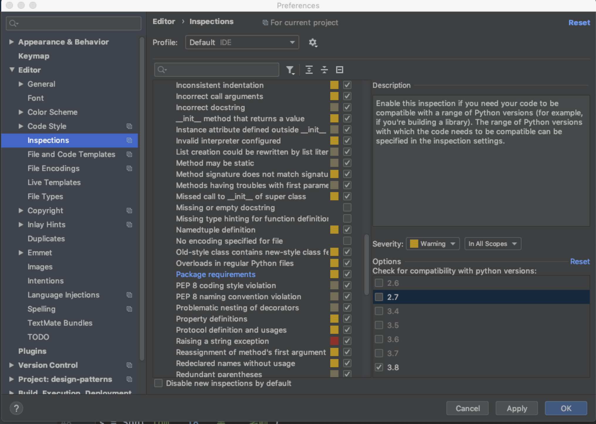

# code style setting

```
Editor --> Code Style --> Hard Wrap at: 79
Tools  --> Python Integrated Tools --> Docstrings --> Docstring format: Google

init-hook=''
pylink --rcfile=pylint.conf app/
```

### 改变pycharm 代码检测解释器
