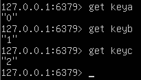
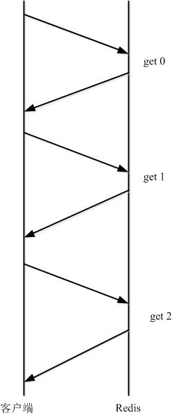
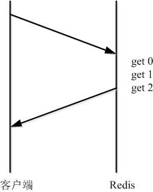

由于网络开销延迟，就算 redis server 端有很强的处理能力，也会由于收到的 client 消息少，而造成吞吐量小。当 client 使用 pipelining 发送命令时，redis server 必须将部分请求放到队列中（使用内存），执行完毕后一次性发送结果；如果发送的命令很多的话，建议对返回的结果加标签，当然这也会增加使用的内存；

> 不过在编码时请注意，pipeline 期间将“独占”链接，此期间将不能进行非“管道”类型的其他操作，直到 pipeline 关闭；如果你的 pipeline 的指令集很庞大，为了不干扰链接中的其他操作，你可以为 pipeline 操作新建 Client 链接，让 pipeline 和其他正常操作分离在2个 client 中。不过 pipeline 事实上所能容忍的操作个数，和 socket-output 缓冲区大小/返回结果的数据尺寸都有很大的关系；同时也意味着每个 redis-server 同时所能支撑的 pipeline 链接的个数，也是有限的，这将受限于 server 的物理内存或网络接口的缓冲能力。
>
## 简介
 Redis 使用的是客户端-服务器（CS）模型和请求/响应协议的 TCP 服务器。这意味着通常情况下一个请求会遵循以下步骤：

- 客户端向服务端发送一个查询请求，并监听 Socket 返回，通常是以阻塞模式，等待服务端响应。
- 服务端处理命令，并将结果返回给客户端。 

1. Redis 客户端与 Redis 服务器之间使用 TCP 协议进行连接，一个客户端可以通过一个 socket 连接发起多个请求命令。每个请求命令发出后 client 通常会阻塞并等待 redis 服务器处理，redis 处理完请求命令后会将结果通过响应报文返回给 client，因此当执行多条命令的时候都需要等待上一条命令执行完毕才能执行。

2. 管道（pipeline）可以一次性发送多条命令并在执行完后一次性将结果返回，pipeline 通过减少客户端与 redis 的通信次数来实现降低往返延时时间，而且 Pipeline 实现的原理是队列，而队列的原理是时先进先出，这样就保证数据的顺序性。 Pipeline 的默认的同步的个数为53个，也就是说 arges 中累加到53条数据时会把数据提交。其过程如下图所示：client 可以将三个命令放到一个 tcp 报文一起发送，server 则可以将三条命令的处理结果放到一个 tcp 报文返回。

> 注意到是用 pipeline 方式打包命令发送，redis 必须在处理完所有命令前先缓存起所有命令的处理结果。打包的命令越多，缓存消耗内存也越多。所以并不是打包的命令越多越好。具体多少合适需要根据具体情况测试。

## 适用场景
 比如有多个 command 需要被“及时的”提交，而且他们对相应结果没有互相依赖，对结果响应也无需立即获得，那么 pipeline 就可以充当这种“批处理”的工具；而且在一定程度上，可以较大的提升性能，性能提升的原因主要是 TCP 连接中减少了“交互往返”的时间。
 
  有些系统可能对可靠性要求很高，每次操作都需要立马知道这次操作是否成功，是否数据已经写进 redis 了，那这种场景就不适合。

  还有的系统，可能是批量的将数据写入 redis，允许一定比例的写入失败，那么这种场景就可以使用了，比如10000条一下进入 redis，可能失败了2条无所谓，后期有补偿机制就行了，比如短信群发这种场景，如果一下群发10000条，按照第一种模式去实现，那这个请求过来，要很久才能给客户端响应，这个延迟就太长了，如果客户端请求设置了超时时间5秒，那肯定就抛出异常了，而且本身群发短信要求实时性也没那么高，这时候用 pipeline 最好了。