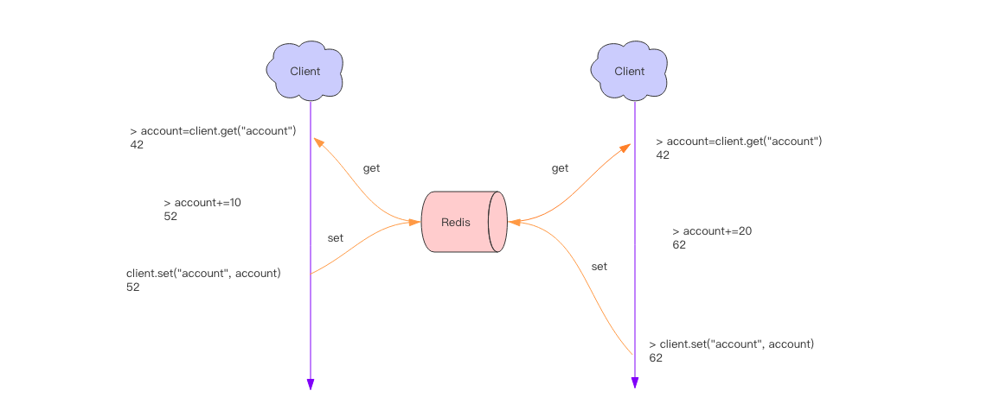

# 分布式锁

分布式应用进行逻辑处理时经常会遇到并发问题。

比如一个操作要修改用户的状态，修改状态需要先读出用户的状态，在内存里进行修改，改完了再存回去。如果这样的操作同时进行了，就会出现并发问题，因为读取和保存状态这两个操作不是原子的。（Wiki 解释：所谓**原子操作**是指不会被线程调度机制打断的操作；这种操作一旦开始，就一直运行到结束，中间不会有任何 context switch 线程切换。）



## 明确你为什么使用分布式锁，为了性能还是正确性？
为了帮你区分这二者，在这把锁 fail 了的时候你可以询问自己以下问题：

1. 要性能的： 拥有这把锁使得你不会重复劳动（例如一个 job 做了两次），如果这把锁 fail 了，两个节点同时做了这个 Job，那么这个 Job 增加了你的成本。

2. 要正确性的： 拥有锁可以防止并发操作污染你的系统或者数据，如果这把锁 fail 了两个节点同时操作了一份数据，结果可能是数据不一致、数据丢失、file 冲突等，会导致严重的后果。

## 用锁保护资源

 在分布式环境下，锁比 mutex 这类复杂，因为涉及到不同节点、网络通信并且他们随时可能无征兆的 fail 。假设了一个场景，一个 client 要修改一个文件，它先申请得到锁，然后修改文件写回，放锁。另一个 client 再申请锁 ... 代码流程如下：


上述图中，得到锁的 client1 在持有锁的期间 pause 了一段时间，例如 GC 停顿。锁有过期时间（一般叫租约，为了防止某个 client 崩溃之后一直占有锁），但是如果 GC 停顿太长超过了锁租约时间，此时锁已经被另一个 client2 所得到，原先的 client1 还没有感知到锁过期，那么奇怪的结果就会发生，曾经 HBase 就发生过这种 Bug。即使你在 client1 写回之前检查一下锁是否过期也无助于解决这个问题，因为 GC 可能在任何时候发生，即使是你非常不便的时候（在最后的检查与写操作期间）。 如果你认为自己的程序不会有长时间的 GC 停顿，还有其他原因会导致你的进程 pause。例如进程可能读取尚未进入内存的数据，所以它得到一个 page fault 并且等待 page 被加载进缓存；还有可能你依赖于网络服务；或者其他进程占用 CPU；或者其他人意外发生 SIGSTOP 等。

## 使用 Fencing （栅栏）使得锁变安全


client1 申请锁同时拿到 token33，然后它进入长时间的停顿锁也过期了。client2 得到锁和 token34 写入数据，紧接着 client1 活过来之后尝试写入数据，自身 token33 比 34 小因此写入操作被拒绝。注意这需要存储层来检查 token，但这并不难实现。如果你使用 Zookeeper 作为 lock service 的话那么你可以使用 zxid 作为递增数字。 但是对于 Redlock 你要知道，没什么生成 fencing token 的方式，并且怎么修改 Redlock 算法使其能产生 fencing token 呢？好像并不那么显而易见。因为产生 token 需要单调递增，除非在单节点 Redis 上完成但是这又没有高可靠性，你好像需要引进一致性协议来让 Redlock 产生可靠的 fencing token。

## 超时问题

Redis 的分布式锁不能解决超时问题，如果在加锁和释放锁之间的逻辑执行的太长，以至于超出了锁的超时限制，就会出现问题。因为这时候第一个线程持有的锁过期了，临界区的逻辑还没有执行完，这个时候第二个线程就提前重新持有了这把锁，导致临界区代码不能得到严格的串行执行。

为了避免这个问题，Redis 分布式锁不要用于较长时间的任务。如果真的偶尔出现了，数据出现的小波错乱可能需要人工介入解决。

EX seconds ： 将键的过期时间设置为 seconds 秒。 执行 SET key value EX seconds 的效果等同于执行 SETEX key seconds value 。
NX ： 只在键不存在时， 才对键进行设置操作。 执行 SET key value NX 的效果等同于执行 SETNX key value 。

```python
tag = random.nextint()  # 随机数
if redis.set(key, tag, nx=True, ex=5):
    do_something()
    redis.delifequals(key, tag)  # 假想的 delifequals 指令
```

有一个稍微安全一点的方案是为 set 指令的 value 参数设置为一个随机数，释放锁时先匹配随机数是否一致，然后再删除 key，这是为了确保当前线程占有的锁不会被其它线程释放，除非这个锁是过期了被服务器自动释放的。 但是匹配 value 和删除 key 不是一个原子操作，Redis 也没有提供类似于`delifequals`这样的指令，这就需要使用 Lua 脚本来处理了，因为 Lua 脚本可以保证连续多个指令的原子性执行。

```lua
# delifequals
if redis.call("get",KEYS[1]) == ARGV[1] then
    return redis.call("del",KEYS[1])
else
    return 0
end
```

但是这也不是一个完美的方案，它只是相对安全一点，因为如果真的超时了，当前线程的逻辑没有执行完，其它线程也会乘虚而入。

## 可重入性

可重入性是指线程在持有锁的情况下再次请求加锁，如果一个锁支持同一个线程的多次加锁，那么这个锁就是可重入的。比如 Java 语言里有个 ReentrantLock 就是可重入锁。Redis 分布式锁如果要支持可重入，需要对客户端的 set 方法进行包装，使用线程的 Threadlocal 变量存储当前持有锁的计数。（以上还不是可重入锁的全部，精确一点还需要考虑内存锁计数的过期时间，代码复杂度将会继续升高）

```python
import threading


locks = threading.local()
locks.redis = {}

def key_for(user_id):
    return f"account_{user_id}"

def _lock(client, key):
    return bool(client.set(key, True, nx=True, ex=5))

def _unlock(client, key):
    client.delete(key)

def lock(client, user_id):
    key = key_for(user_id)
    if key in locks.redis:
        locks.redis[key] += 1
        return True
    ok = _lock(client, key)
    if not ok:
        return False
    locks.redis[key] = 1
    return True

def unlock(client, user_id):
    key = key_for(user_id)
    if key in locks.redis:
        locks.redis[key] -= 1
        if locks.redis[key] <= 0:
            del locks.redis[key]
            client._unlock(key)
        return True
    return False
```

