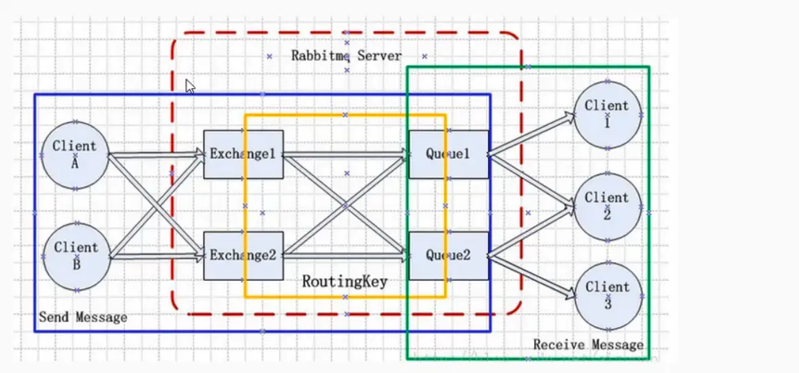

## Exchange
交互机，根据路由键转发消息到绑定的队列

服务器直接发送给交换机（Exchange），然后根据确定的规则（路由键 routing key），RabbitMQ将会决定消息该投递到哪个队列(Queue)。

### 4种Exchange
> Direct Exchange：将消息中的Routing key与该Exchange关联的所有Binding中的Routing key进行比较，如果相等，则发送到该Binding对应的Queue中。

> Topic Exchange：将消息中的Routing key与该Exchange关联的所有Binding中的Routing key进行对比，如果匹配上了，则发送到该Binding对应的Queue中。

> Fanout Exchange：直接将消息转发到所有binding的对应queue中，这种exchange在路由转发的时候，忽略Routing key。

> Headers Exchange：将消息中的headers与该Exchange相关联的所有Binging中的参数进行匹配，如果匹配上了，则发送到该Binding对应的Queue中。
