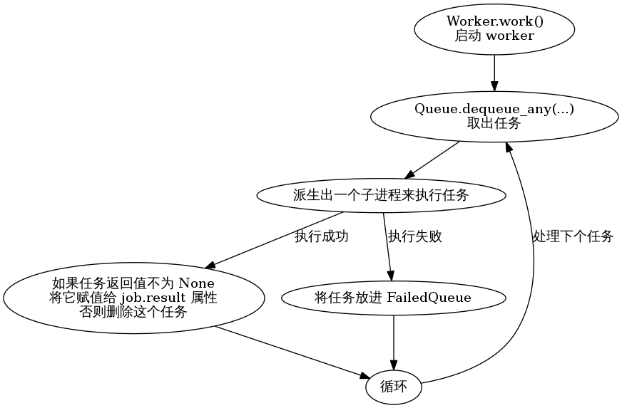

RQ----Workers
=============
worker就是一个Python进程，运行在后台用于执行那些费时的、阻塞的任务。因为这些任务并没有必要把他放在web应用中处理，比如用户注册时发送邮件验证其有效性的操作。  

###启动worker
启动worker进程非常简单，只需从工程根目录下运行命令：  

    $ rqworker high normal low
    20:52:58 RQ worker started, version 0.4.6
    20:52:58
    20:52:58 *** Listening on high, normal, low...
Worker会从指定的队列中读取jobs（任务），读取顺序是按照其先后顺序（high，normal，low）来处理的，worker会不断循环处理，直到所有任务处理完成后才处于等待状态。  
每个worker在同一时间只处理单个任务，在worker中没有并发处理，如果你想并发地处理任务，那么启动多个worker即可。  

###Burst 启动模式
默认情况下，workers启动后立马开始工作，直到所有任务完成时开始阻塞等待新的任务进来，不过workers还可以以一种叫`burst`的模式启动，这种方式启动时，workers完成所有任务后，一旦返现队列没有任务了，那么该进程就退出。  
这种使用场景一般用于临时性处理一些任务，或者业务高峰期临时扩展业务来处理一下这些任务。  

###深入worker
####worker的生命周期
worker的生命周期由如下几个步骤构成：  

1. 启动，加载Python环境
2. 登记，worker自生注册，让系统知道有这么一个worker
3. 监听，监听从给定的Redis队列中弹出的任务，如果所有队列都是空的，分两步走，如果以burst模式启动，那么worker会立即退出，否则一直等待直到有任务进入队列。
4. 准备执行任务，worker告诉系统它将开始工作，这是他会把自己的状态设置成`busy`，然后在`StartedJobRegistry`注册任务。
5. fork一个子进程，子进程（又称为work horse)是forked出来用来处理真实的任务在一个有故障自检的上下文中
6. 处理任务，这一步执行真正的任务工作在work horse中
7. 清空任务执行，worker会设置自身的状态为`idle`（空闲）。然后设置任务以及他的结果过期基于`resutl_ttl`，Job同时从`Startedjobregistry`移除，添加到`FinishedJobRegistry`中，如果成功执行的话，否则会放到`FailedQueue`中去。  
8. 循环，重复第三步

###性能贴士
基本上，`rqworker` shell 脚本是一个简单的fetch-fork执行循环，当很多任务做很多设置或者他们都依靠相同的模块，你可以在每次执行任务的时候支付这个开销（因为你在forking之后正在导入）。这是很清晰的，因为RQ并不会泄露内存，更不会变慢。  
你可以使用一种模式提高其吞吐量的性能，没有任何方法告诉RQ workers去执行，但是你可以自己启动循环。  

为了达到这种效果，自己提供一个脚本（取代rqworker）。简单实现例子：  
    
    #!/usr/bin/env python
    import sys
    from rq import Queue, Connection, Worker

    #预加载库
    import library_that_you_want_prelaoded

    #提供队列名字准备去监听
    # 类似于 rqworker
    with Connection():
        qs = map(Queue, sys.argv[1:]) or [Queue()]
        w = Worker(qs)
        w.work()

####进程名字
Workers注册到系统以他们的名字，你可以看monitoring，默认情况下，worker的名字等于当前的hostname和当前的PID追加而成，要是要覆盖这个默认的名字，可以在启动worker的时候，使用`--name`选项来指定。  

###终止workers
任何时候，workers接收`SIGINT`（又叫Ctrl+C）或者`SIGTERM`（又叫kill），worker等待知道当前正在运行的任务完成，就会停止work循环，然后优雅地注册自己死亡。  
如果在down的过程中，`SIGINT`或者`SIGTERM`再次接收了，那么worker将强制终止子进程（通过发送SIGKILL).但是仍然会注册自己死亡。  
###使用配置文件
如果你喜欢通过配置文件的方式来配置`rqworker`，那么你可以通过类似`settings.py`的方式指定配置：  
    
    REDIS_HOST = “redis.example.com”
    REDIS_PORT = 6379

    # 你还可以指定Redis DB去使用
    # REDIS_DB = 3
    # REDIS_PASSWORD = ‘VERY SECRET’

    # 要监听的队列
    Queue = [‘high’,’normal’, ‘low’]

