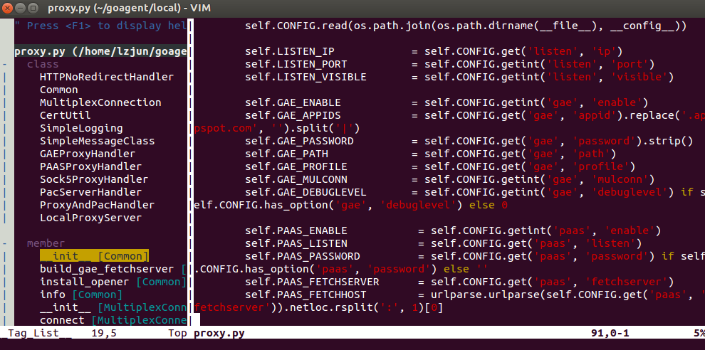

每日一Vim（20）Tagelist初体验
---------------------------

Taglist 插件一个源代码浏览器，这个插件在今年发布了4.6的版本，4.5还要追溯到2007年Taglist需要结合ctag才能使用，否则会出现: *Exuberant ctags (http://ctags.sf.net) not found in PATH.Plugin is not loaded*这样的错误。

####下载安装：
[ctag](http://sourceforge.net/projects/ctags/?source=dlp)  
[taglist](http://sourceforge.net/projects/vim-taglist/?source=dlp)  
上面两个链接有可能需要fan墙，找到对应平台的压缩包后，解压。windows平台下的**ctags**直接把ctags.exe放到Vim的安装目录即可，对于Linux，需要编译安装:  

    $tar -zvxf ctags-5.8.tar.gz
    $cd ctags-5.8
    $./configure
    $make
    $sudo make install

对于taglist，解压后有对应如下的文件目录：  
    
    ├── doc
    │   └── taglist.txt
    └── plugin
        └── taglist.vim

Windows：把taglist.txt和taglist.vim分别放到Vim安装目录对应的doc和plugin目录下。
Linux：把taglist.txt和taglist.vim分别放到`~/.vim`目录下的doc和plugin目录下。如果没有.vim没有，就先创建。总之，不管什么平台，原理是一样的。

正确安装完成后，我们就可以拿它来一展身手了。首先我们看看下面这个效果图：
  

这看起来就有点Eclipse的味道了，左侧是类，方法，等成员的缩略图(taglist窗口），右侧是代码区窗口。当打开一个文件时（c或者python等编程语言的文本）,命令模式下输入：`TlistToggle`就可以出现上面的效果图，再次输入`TlistToggle`时该窗口又会关闭。

最后推荐一个视频给大家：[周鸿祎谈颠覆式创新](http://www.wpcourse.com/innovation-of-zhou.html)，看前半部分内容就可以了。

转载请注明出处，谢谢合作！作者---[zhijun](http://weibo.com/527355345) 
